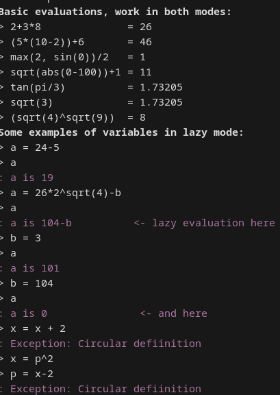

# Lazy Calculator
Assignment for my university
## CLI full feature calculator with binary and unary functions, variable and lazy evaluation support. Supports rendering expression AST
### Concept
1. There is a basic interpreter, the input is tokenized and passed through **shunting yard algorithm**.
2. The result may be used to evaluate the expression already(non-lazy mode), or to construct an **abstract syntax tree**(lazy mode).
3. The AST is solved if it's an expression, or simplified if it's a variable assignment
    - a = (2 * 4 + b) becomes (8 + b)

#### BTW. Lazy means not evaluated instantly. That means `a = b ^ 2` will change based on value of `b`, without need to reassign `a`.
### Usage
There are two modes:
- non-lazy, basically single line evaluation, which doesn't suppport variables
- **lazy, full features**

There is **dynamic config** that may be changed with commands. The help screen is displayed on start, you can get it back with `help`. I also highly encourage you to use `examples` command.

#### To run, use your favourite c# framework, was tested on .NET 10

### Notes
- Stack, Queue and List data structures were implemented by me, as per assignment. To change that back, replace every `StackX, QueueX, ListX` with according structure without X.
- Supported functions: 
    - *infix:* `+ - * / ^`
    - *prefix unary*: `abs sin cos sqrt tan`
    - *prefix binary*: `max(a,b) min(a,b) lze(a,b)` (lze is less than or equal, like in assembly)
### Try online
You can use [dotnetfiddle](https://dotnetfiddle.net/Pf6Xsu). Kind of breaks my beautiful interpreter appearance, but still works. I would't recommend reading it there though, it's 800 lines glued together.
### Examples

